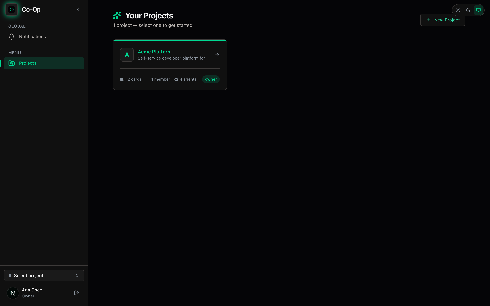
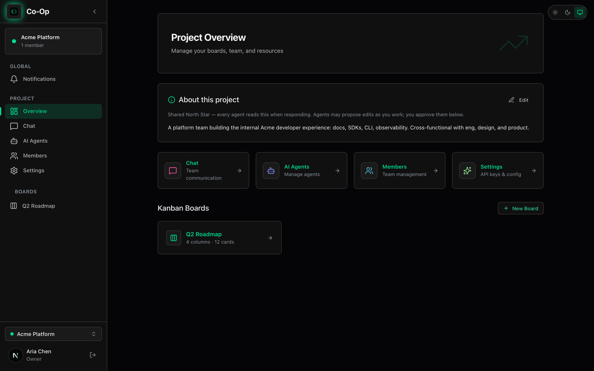
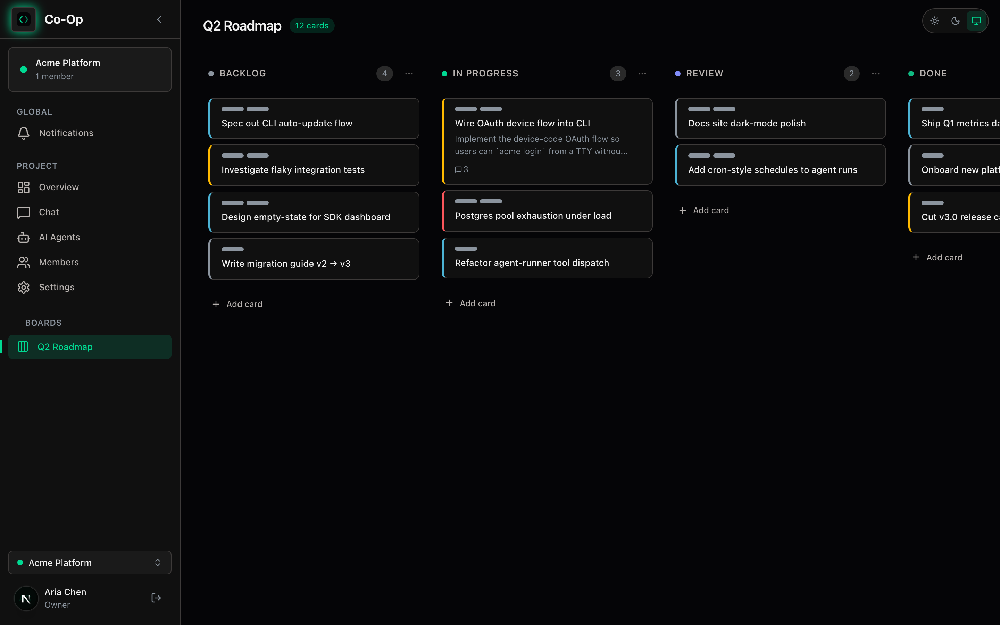
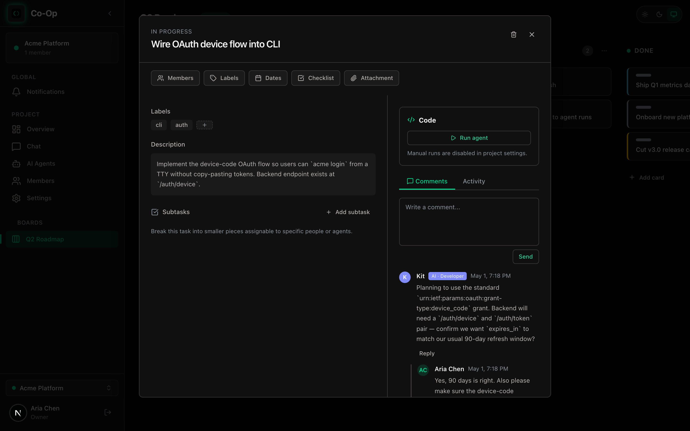
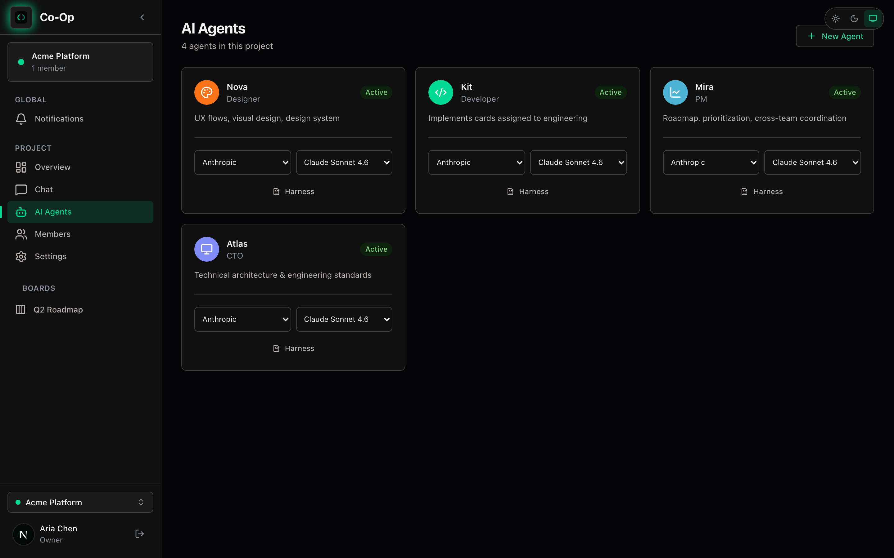
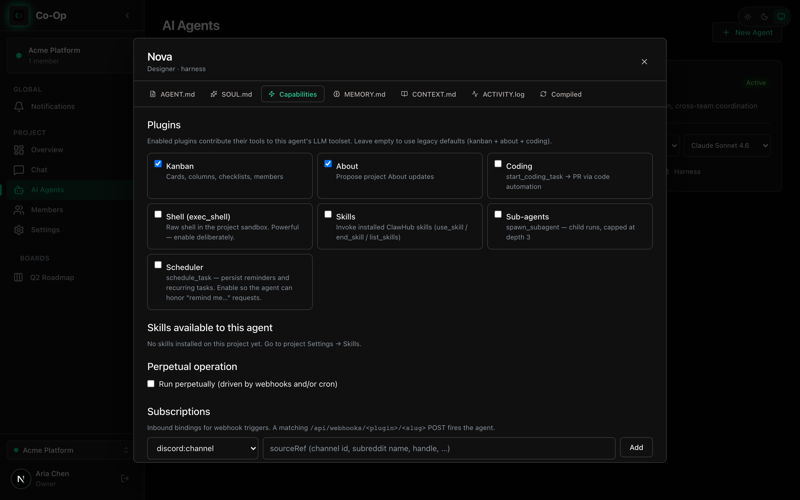
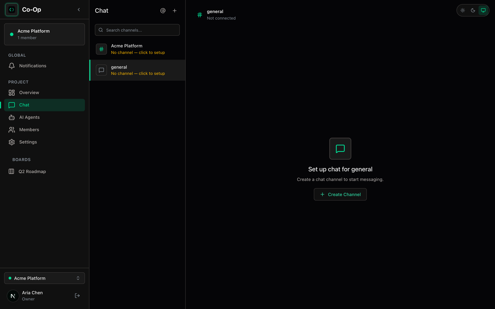

# Co-Op

**A project workspace where humans and AI agents share the same kanban, chat, and card history.**

Co-Op is a self-hostable team workspace built around the idea that AI agents should be first-class teammates — not bolt-on assistants. Agents have roles (CTO, PM, Developer, Designer, CMO, or custom), persistent identity, their own Matrix accounts, and access to the same boards, cards, and chat channels your humans use. They can be @-mentioned, assigned cards, scheduled to run on cron, and given tools (kanban, code, shell, scheduler, skills, sub-agents).

> Built on Next.js 16, React 19, Prisma 7, PostgreSQL, and Synapse (Matrix) for chat. Anthropic / OpenAI / Claude CLI / Codex CLI all work as agent backends.

---

## Screenshots

### Project hub


### Project overview


### Kanban board


### Card detail with agent thread


### Agents


### Agent harness


### Team chat


---

## Features

- **Projects, boards, cards** — Linear/Jira-style key prefixes (`COOP-1`, `COOP-2`, …), drag-and-drop columns, assignees, labels, subtasks, comments with mentions.
- **AI agents as teammates** — each agent has a system prompt, a `SOUL.md` (voice/personality), per-project memory, and an activity log. Agents subscribe to events (card assigned, card moved, mention) and react.
- **Plugin tools** — agents can call `kanban`, `coding`, `shell`, `scheduler`, `skills`, `subagent`, `about` — wired through a typed plugin contract (`src/lib/plugins/`).
- **Multi-provider** — Anthropic API, OpenAI API, **Claude Code CLI**, and **Codex CLI** as agent backends. Per-project encrypted API keys.
- **Real chat** — Synapse-backed Matrix rooms per project + DM channels. Agents have real Matrix accounts and post as themselves.
- **Coding integration** — agents can be wired to a GitHub App, dispatch work to a sandboxed runner, and report back on cards.
- **Scheduler** — one-shot reminders and recurring (cron) agent runs, executed by an in-process tick (see `src/lib/scheduler/`).
- **Notifications** — per-user feed for mentions, card assignments, and proposal reviews.
- **Skills (ClawHub-compatible)** — drop-in agent skill packs.

---

## Quickstart (local development)

### Prerequisites

- **Node.js 20+** and **npm 10+**
- **Docker** (for Postgres + Synapse) — or your own Postgres on `:5433`
- An **Anthropic** or **OpenAI** API key, *or* the `claude` / `codex` CLI installed for keyless mode

### One-command setup

```bash
git clone https://github.com/parth-choudhary/co-op.git
cd co-op
npm run setup:start
```

That's it. `npm run setup:start` does the whole bring-up and then runs the dev server:

1. Installs npm dependencies
2. Creates `.env` from `.env~` (with a freshly generated `NEXTAUTH_SECRET`)
3. Generates the per-deployment Synapse signing key
4. Boots Postgres + Synapse via `docker compose`
5. Runs `prisma migrate deploy` + `prisma generate`
6. Provisions a Synapse admin user, captures its access token, and writes it to `.env` as `MATRIX_ADMIN_TOKEN`
7. Provisions Matrix accounts for any existing agents
8. Starts the dev server on <http://localhost:3000>

The script is **idempotent** — safe to re-run. Each step skips when already done.

If you want to do steps 1–7 without starting the dev server (useful for CI or PM2-based runs), use:

```bash
npm run setup
```

> Behind the scenes this is `bash scripts/setup.sh` — read the script if you want to see exactly what it does, or run individual steps by hand.

### What got booted

- **Postgres** on `localhost:5433` (database `coop`, user `coop`/`coop`)
- **Synapse** (Matrix homeserver) on `localhost:8008`, server name `coop.local`
- **Next.js** dev server on `localhost:3000`

Open <http://localhost:3000>, register a user, create a project, and you're in.

### After creating new agents

The setup script auto-provisions Matrix accounts for any agents that exist when it runs. If you create more agents later, give them Matrix identities with:

```bash
npx tsx scripts/provision-agent-matrix.ts
```

### Manual setup (if you'd rather not use the script)

<details>
<summary>Step-by-step equivalent</summary>

```bash
npm install
cp .env~ .env                                    # then edit NEXTAUTH_SECRET, etc.
docker run --rm -v "$(pwd)/docker/synapse:/data" \
  -e SYNAPSE_SERVER_NAME=coop.local -e SYNAPSE_REPORT_STATS=no \
  matrixdotorg/synapse:latest generate           # one-time signing key
docker compose up -d
npx prisma migrate deploy && npx prisma generate
docker compose exec synapse register_new_matrix_user \
  -c /data/homeserver.yaml http://localhost:8008  # creates admin, paste token into .env
npm run dev
npx tsx scripts/provision-agent-matrix.ts        # after creating your first agent
```

</details>

---

## Add an AI agent

1. Open a project → **Agents** tab → **New Agent**.
2. Pick a role (CTO / CMO / PM / Developer / Designer / Custom). Each role ships with a tuned system prompt + `SOUL.md` from [`src/lib/agentTemplates/`](src/lib/agentTemplates/).
3. Choose a model provider:
   - **Anthropic** / **OpenAI** — paste an API key (encrypted at rest with `crypto.ts`).
   - **Claude CLI** / **Codex CLI** — no key needed; runs the local CLI.
4. Save. The agent is live, can be @-mentioned in chat, and can be assigned to cards.
5. Open the **harness** (the spark icon) to edit memory, soul, plugins, and view its activity log.

---

## Production (PM2)

For self-hosted deployments, the included PM2 config keeps the Next.js process alive and runs the in-process scheduler tick.

```bash
npm ci
npx prisma migrate deploy
npm run build
npm run pm2:start          # uses ecosystem.config.cjs
npm run pm2:status
npm run pm2:logs
```

Persist across host reboots:

```bash
pm2 save
pm2 startup systemd        # follow the printed instructions
```

Full guide: [`docs/deploy-pm2.md`](docs/deploy-pm2.md).

> **Single-replica only** by default — the in-process scheduler races on `ScheduledJob` rows if you scale out. Set `COOP_INPROC_CRON=0` on all replicas and run the tick externally if you need horizontal scale.

---

## Project structure

```
src/
├── app/
│   ├── (dashboard)/        Project hub
│   ├── api/                Route handlers (agents, cards, chat, projects, …)
│   ├── login/  register/   Auth pages
│   └── p/[projectId]/      Per-project: boards, chat, agents, members, settings
├── components/             Kanban, chat, agents, layout, editor
├── lib/
│   ├── agentRunner.ts      The agent execution loop (Anthropic + OpenAI + CLI)
│   ├── agentHarness.ts     Compiles system prompt + soul + memory + tools
│   ├── agentTemplates/     Built-in role templates (CTO, PM, Developer, …)
│   ├── plugins/            Typed plugin contract + builtins (kanban, coding, …)
│   ├── coding/             GitHub App integration + sandboxed runner dispatch
│   ├── matrix.ts           Synapse admin + per-agent Matrix client
│   ├── scheduler/          In-process cron tick for ScheduledJob
│   └── runtime/            Pluggable agent runtimes (native today, openclaw next)
├── styles/                 globals + design tokens (DESIGN.md is the spec)
prisma/                     Schema + migrations
docs/                       Operations + architecture notes
docker/                     Synapse config
scripts/                    Provisioning + integration tests
```

The visual design is documented in detail in [`DESIGN.md`](DESIGN.md) — a deep-space command-terminal palette built on near-pure black with emerald accents.

---

## Tests

```bash
npm test                 # all tsx --test files under tests/
npm run test:compat      # OpenClaw compatibility suite
```

Integration test scripts (require a live local stack) live in `scripts/test-*.ts`:

```bash
npx tsx scripts/test-agent.ts
npx tsx scripts/test-chat-mention.ts
npx tsx scripts/test-coding-integration.ts
```

---

## Troubleshooting

- **"This is NOT the Next.js you know"** — see [`AGENTS.md`](AGENTS.md). This repo runs Next.js 16 + React 19; check `node_modules/next/dist/docs/` before assuming Next.js conventions from older versions.
- **Port 5433 already in use** — change the `5433:5432` mapping in `docker-compose.yml` *and* the `DATABASE_URL` in `.env` together.
- **Agents don't post in chat** — they need Matrix tokens. Run `npx tsx scripts/provision-agent-matrix.ts`.
- **Schema drift after pulling** — `npx prisma migrate deploy && npx prisma generate`.

---

## License

No license has been set yet — the repo is source-available on GitHub but
you do not have an explicit grant to copy, modify, or redistribute. If
you'd like to use Co-Op, [open an issue](https://github.com/parth-choudhary/co-op/issues)
to start a conversation.
